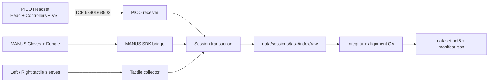

<div align="center">

# PICO × MANUS × Tactile | Capture Platform

**PICO、MANUS 与触觉阵列的多模态同步采集、质量检查和 HDF5 导出。**

`PICO · MANUS · Tactile · QA · HDF5`

> 项目展示风格：数据平台介绍 · 下方保留原有工程文档、状态与安全约束。

</div>

---

<div align="center">

# PICO × MANUS × Tactile Capture

**面向具身智能与第一视角操作研究的多模态采集、同步、质检与导出工具链**

[](https://www.python.org/)
[](docs/WINDOWS_DEPLOY_ZH.md)
[](https://github.com/lemon977/pico_manus_tac/actions/workflows/tests.yml)
[](#采集内容)

[快速开始](#快速开始) · [数据格式](#数据组织) · [采集员手册](采集员操作说明.md) · [部署文档](docs/WINDOWS_DEPLOY_ZH.md) · [数据管线](docs/PIPELINE_ZH.md)

</div>

---

## 项目简介

本项目在一台 Windows 电脑上同步采集 PICO 头显/双手柄位姿、PICO 双目
VST、双手 MANUS 25 节点骨架和双手触觉阵列，并将各数据流投影到统一时钟，
最终导出适合训练和标注的 HDF5 数据集。

采集链路采用“常驻服务 + 单条事务”的设计：设备持续在线，但只有收到同一
session 的 `START` 后才写盘。任何传感器掉线、写盘错误、视频损坏或封存失败
都会使本条数据 fail-closed，不会把不完整样本标成成功。

## 核心能力

| 能力 | 说明 |
|---|---|
| 多模态同步 | PICO、MANUS、VST、双手触觉统一保存墙钟和高精度 QPC 时间戳 |
| 高分辨率双目 | 默认采集 `4096×1536 @ 30 FPS` SBS，单眼 `2048×1536` |
| 事务式采集 | 三路并发 START/STOP；必须取得完成证明和 idle 终态 |
| 运行期防呆 | 设备新鲜度、手柄/手套在线状态、帧缺口和异步写盘队列持续监控 |
| 视频完整性门禁 | 校验 SPS/PPS/IDR、完整解码帧数、分辨率、字节数及两份 sidecar |
| 可审计标定 | 每条保存 PICO 相机参数快照和 MANUS 标定文件哈希/加载结果 |
| 任务优先目录 | 同一任务的原始数据、对齐结果、HDF5、manifest 和 review 放在同一父目录 |
| 可恢复失败归档 | 重采、撤销和故障样本移入 rejected/deleted，不静默覆盖正式数据 |

## 系统架构



## 采集内容

| 数据流 | 典型速率 | 会话文件 |
|---|---:|---|
| PICO Head + Controllers | 约 70–75 Hz | `raw/pico.jsonl` |
| PICO VST 双目视频 | 约 30 FPS | `raw/vst.h264` + 两个时间戳 sidecar |
| MANUS 双手骨架 | 约 120 Hz | `raw/manus.jsonl` + `raw/manus.meta.json` |
| 双手触觉 | 每侧请求 60 Hz | `raw/tactile.jsonl` + `raw/tactile.meta.json` |
| 训练数据 | 默认 30 Hz | `aligned.jsonl` + `dataset.hdf5` |

> 实际频率始终以每条数据的时间戳和 manifest 为准，不使用裸 H.264 的标称
> FPS 作为对齐依据。

## 快速开始

### 1. 环境

- Windows 10/11 x64
- Python 3.11
- FFmpeg / ffprobe
- PICO 头显、左右手柄及 XRoboToolkit client
- MANUS dongle、左右手套及合法安装的 MANUS SDK
- 两只 HS13 触觉设备（CH340 串口）

```powershell
git clone git@github.com:lemon977/pico_manus_tac.git
cd pico_manus_tac

powershell -ExecutionPolicy Bypass -File .\scripts\setup_windows.ps1
powershell -ExecutionPolicy Bypass -File .\scripts\configure_pico_firewall.ps1
```

MANUS SDK 不随仓库分发。请参考
[Windows 部署说明](docs/WINDOWS_DEPLOY_ZH.md)构建桥接程序。

### 2. 私有配置

真实手套 ID、个人 `.mcal`、PICO 序列号和设备相机参数不会进入 Git。首次部署需在
本地准备：

```text
config/tactile_pairing.json
config/manus_left.mcal
config/manus_right.mcal
config/pico_cam/devices/<PICO_SERIAL>/camera_params.json
```

可以从 `config/tactile_pairing.example.json` 复制触觉模板，再替换左右 MANUS
glove ID。详细要求见[采集员操作说明](采集员操作说明.md)。

### 3. 一键采集

1. PICO App 打开 `Send + Head + Controller + VST`。
2. 接好 MANUS dongle/手套和两只触觉设备。
3. 双击 `COLLECT_DATA.cmd`。
4. 按窗口提示完成触觉静止基线和左手按压识别。
5. 在待机状态按 Enter 开始；动作完成后再按 Enter 停止并导出。

```powershell
# 部署/故障自检
powershell -ExecutionPolicy Bypass -File .\ego_ctl.ps1 check

# 查看三路状态
powershell -ExecutionPolicy Bypass -File .\ego_ctl.ps1 status
```

## 数据组织

```text
data/
├─ sessions/<task>/<index>/
│  ├─ raw/
│  │  ├─ pico.jsonl
│  │  ├─ manus.jsonl
│  │  ├─ manus.meta.json
│  │  ├─ tactile.jsonl
│  │  ├─ tactile.meta.json
│  │  ├─ vst.h264
│  │  ├─ vst.ts.jsonl
│  │  └─ vst.qpc.ts.jsonl
│  ├─ aligned.jsonl
│  ├─ dataset.hdf5
│  ├─ manifest.json
│  └─ review/
├─ rejected/   # 传感器故障、主动重采
└─ deleted/    # 使用数据管理工具删除后的可恢复归档
```

`data/`、日志、设备标定和个人标定均被 `.gitignore` 排除。请勿使用普通文件管理器
直接重命名或删除正式会话；使用项目提供的 `DELETE_BATCH_DATA.cmd`。

## 数据质量策略

- 开录前要求全部所需数据流连续稳定 2 秒。
- 默认姿态、手套、触觉和 VST 数据年龄不得超过 800 ms。
- 录制中每 0.5 秒检查一次；异常持续 1.5 秒即停止并作废本条。
- PICO/MANUS JSONL 和 VST 使用独立有界异步队列，避免慢盘阻塞接收线程。
- VST 只从完整的 SPS/PPS + IDR 开始封存；STOP 后完整解码复验。
- 双触觉封存核对帧数、字节数、SHA-256、订阅缺口与临时文件状态。
- 离线导出默认要求各路覆盖率 ≥95%、`|offset| p95 ≤30 ms`、最大 ≤40 ms。
- pipeline 或 manifest 失败会停止当前批次，禁止跳号继续制造半成品。

## 文档

| 文档 | 面向对象 | 内容 |
|---|---|---|
| [采集员操作说明](采集员操作说明.md) | 数采人员 | 开机检查、按键、异常处理、数据位置 |
| [Windows 部署](docs/WINDOWS_DEPLOY_ZH.md) | 部署人员 | 依赖、MANUS SDK、服务与防火墙 |
| [数据管线](docs/PIPELINE_ZH.md) | 算法/数据工程 | 对齐、质量门禁、HDF5 schema |
| [坐标系](docs/COORDINATE_TRANSFORMS_ZH.md) | 算法开发 | PICO/MANUS/相机坐标变换 |
| [标定与验收](docs/CALIB_QA_ZH.md) | 标定人员 | 标定证据、视频和同步验收 |
| [Stereo PnP](docs/STEREO_PNP_ZH.md) | 视觉开发 | 双目投影与 PnP 辅助流程 |

## 开发与测试

```powershell
python -m pip install -r requirements-windows.txt
python -m py_compile pico_record.py pico_receiver.py manus_collector.py tactile_collector.py
python -m unittest discover -s tests -v
```

测试不需要真实采集数据，也不会访问硬件。贡献代码前请阅读
[CONTRIBUTING.md](CONTRIBUTING.md)。

## 隐私与第三方依赖

- 禁止提交采集视频、人体骨架、触觉数据、运行日志、设备序列号或个人 `.mcal`。
- MANUS SDK、DLL、头文件和示例代码受厂商许可约束，不包含在本仓库中。
- 本项目不是 PICO 或 MANUS 官方产品；使用者需自行遵守硬件 SDK 和数据合规要求。
- 当前仓库尚未声明开源许可证；未经许可不自动授予复制、再发布或商用权利。

## 作者

Maintained by [@lemon977](https://github.com/lemon977).
