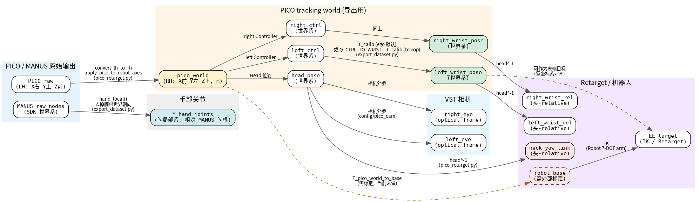

# 坐标系与转换关系（pico_controller）

本文档用一张图说明：PICO + MANUS 原始数据 → 训练包 `egodex_v1` → 机器人末端目标，整个管线里都有哪些坐标系、怎么转、在哪段代码里完成。

> 如果你只想看一眼图，直接看下面 `coordinate_frames.png`。

---

## 1. 总览图



（源文件：`coordinate_frames.dot`，可用 `dot -Tpng coordinate_frames.dot -o coordinate_frames.png` 重新渲染。）

---

## 2. 图中每个坐标系的含义

| 坐标系 | 名字 | 含义 | 当前在哪出现 |
|--------|------|------|-------------|
| `PICO raw (LH)` | PICO 原始输出 | 左手系，X 右 / Y 上 / Z 前 | `pico.jsonl` 里的 `Head/Controller.{left,right}.pos/quat` |
| `pico_world` | PICO tracking world | **右手系 REP-103**，X 前 / Y 左 / Z 上，单位米 | `export_dataset.py` 导出后的 `head_pose` / `*_controller_pose` / `*_wrist_pose` 都在这系下 |
| `head_pose` | 头部位姿 | `pico_world` 下的头 | HDF5 `head_pose` |
| `left_ctrl / right_ctrl` | 左右手柄 | `pico_world` 下的手柄原点 | HDF5 `left_controller_pose` / `right_controller_pose` |
| `left_wrist_pose / right_wrist_pose` | 左右腕位姿 | 手柄原点叠 `T_calib` 后得到的腕位姿 | HDF5 `left_wrist_pose` / `right_wrist_pose` |
| `*_hand_joints` | 手腕局部系 | 相对 MANUS 腕根（node0）的局部坐标 | HDF5 `left_hand_joints` / `right_hand_joints` |
| `MANUS raw nodes` | MANUS SDK 输出 | 25 节点在世界系下的位姿（含 node0 腕根） | `manus.jsonl` 里的 `nodes` |
| `neck_yaw_link` | 头-relative | 以头为原点、头朝向为 X 前 | `pico_retarget.py` 实时输出 |
| `left_wrist_rel / right_wrist_rel` | 手腕头-relative | 相对头的腕位姿 | `pico_retarget.py` 实时输出 |
| `robot_base` | 机器人基座系 | 固定机械臂的 base frame | **当前未标定，需要外部标定** |
| `left_eye / right_eye` | 左右眼相机光心 | VST 双目相机的 optical frame | `config/pico_cam/vst_cam.json` |

---

## 3. 关键转换步骤

### 3.1 PICO 原始 → `pico_world`

在 `pico_retarget.py` / `export_dataset.py` 里都做了一样的事：

```python
from pico_retarget import convert_lh_to_rh, apply_pico_to_robot_axes

world_pose = apply_pico_to_robot_axes(convert_lh_to_rh(raw_pose))
```

- `convert_lh_to_rh`: PICO 左手系 → 右手系（Z 取反，W 取反）
- `apply_pico_to_robot_axes`: PICO 轴（X 右/Y 上/Z 前）→ 机器人轴（X 前/Y 左/Z 上）

之后所有的人/手/头都在同一个 `pico_world` 下。

### 3.2 手柄原点 → 手腕位姿

`export_dataset.py` 默认是 **ego 约定**（非遥操）：

```python
wrist_pose = compose_pose(ctrl_world_pose, T_calib)
```

如果加 `--teleop-wrist`，会先叠一个绕 `(1,0,1)` 转 180° 的 `Q_CTRL_TO_WRIST`，再叠 `T_calib`。

`T_calib` 由 `calibrate_wrist.py` 解出，存在 `config/calib_wrist.json`；导出时实际应用的
数值会写入 HDF5 `attrs.controller_to_wrist_calibration`，下游不依赖外部配置文件也能复现。

### 3.3 MANUS raw → 手腕局部系

```python
from export_dataset import hand_local

local_joints = hand_local(manus_nodes)
```

以 MANUS node0（腕根）为原点，去掉腕根的世界朝向，只保留手形。

### 3.4 `pico_world` → 头-relative

`pico_retarget.py` 实时做：

```python
from pico_retarget import relative_pose

wrist_rel = relative_pose(head_world, wrist_world)
```

即 `head^-1 * wrist`，得到手腕相对于头的位姿。

### 3.5 `pico_world` → `robot_base`

**这一步当前没有做。** 要让 PICO world 真正用于固定基座机器人，需要：

```text
T_robot_base_to_pico_world
```

或等价的：

```text
T_pico_world_to_robot_base
```

获取方式：
- 方案 A：采集时让人胸口正对机器人 base，用第一帧 head pose 近似对齐（糙但快）。
- 方案 B：在机器人 base 上贴 AprilTag / 棋盘格，用眼相机 PnP 算 `T_camera_to_base`，再结合相机外参得到 `T_pico_world_to_base`。
- 方案 C：手握手柄触碰机器人 base 上的已知点，解最小二乘外参。

---

## 4. 当前 HDF5 里到底存了什么

以 `data/export/vc1.hdf5` 为例：

```text
head_pose              -> pico_world 下的头
left_controller_pose   -> pico_world 下的左手柄（校准前）
right_controller_pose  -> pico_world 下的右手柄（校准前）
left_wrist_pose        -> pico_world 下的左腕（已叠 T_calib）
right_wrist_pose       -> pico_world 下的右腕（已叠 T_calib）
left_hand_joints       -> 腕局部系（25 节点 × 3）
right_hand_joints      -> 腕局部系
left_hand_valid        -> MANUS 左是否有效
right_hand_valid       -> MANUS 右是否有效
video_frame_idx        -> VST SBS 帧号
```

正式 `complete_frames_v4` 包只保留所有已请求传感器同时有效的目标行；
`source_row_idx` 记录筛选前行号，任何剔除缺口都会产生新的 `segment_id`。

**没有存：**
- `neck_yaw_link` 头-relative 腕位姿（`pico_retarget.py` 实时才有）
- `robot_base` 系下的位姿
- 机器人关节角

这些需要你在训练/部署脚本里再转一次。

---

## 5. 推荐：统一转换层

目前转换逻辑分散在：

- `pico_retarget.py`：PICO raw → pico_world → head-relative
- `export_dataset.py`：PICO raw → pico_world → wrist_world，MANUS → hand_local
- `calibrate_wrist.py`：解 `T_calib`
- 以后训练/部署脚本：再各自写一遍 world → base / head-relative

按你前面说的思路，最好抽一层 `transforms.py`，把所有坐标系关系集中管理。例如：

```python
# transforms.py 示意
from pico_retarget import relative_pose, compose_pose

def world_to_head(pose_world, head_world):
    """pico_world -> neck_yaw_link (头-relative)"""
    return relative_pose(head_world, pose_world)

def head_to_world(pose_head, head_world):
    """neck_yaw_link -> pico_world"""
    return compose_pose(head_world, pose_head)

def world_to_robot_base(pose_world, T_pico_world_to_base):
    """pico_world -> robot_base"""
    # T_base_to_world^-1 * T_world = T_base_to_pose
    ...

def robot_base_to_world(pose_base, T_pico_world_to_base):
    ...
```

这样 `train.py`、`retarget.py`、`policy.py` 都调用同一套函数，不会各写各的矩阵定义。

---

## 6. 不同下游该用哪种表示

| 下游 | 推荐输入 | 说明 |
|------|---------|------|
| 固定基座双臂机器人 | `robot_base` 系下的手腕目标 + IK | 需要先标定 `T_pico_world_to_base` |
| 人形 / 头带相机 ego policy | `neck_yaw_link` 头-relative | 和相机观察天然对齐 |
| 视觉模仿学习（ACT / Diffusion Policy） | 图像 + joint space 或头-relative | 常见做法，不是必须世界系 |
| 离线分析 / 可视化 | `pico_world` | 最直观，环境物体不动 |

核心原则：**同一份 world + head 数据可以导出任意表示**；不要在采集时就把自己锁死成一种。
