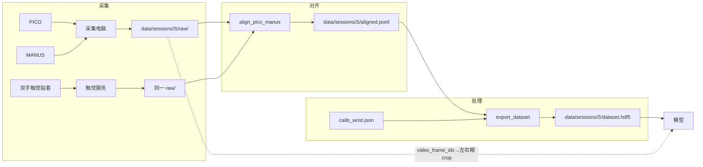
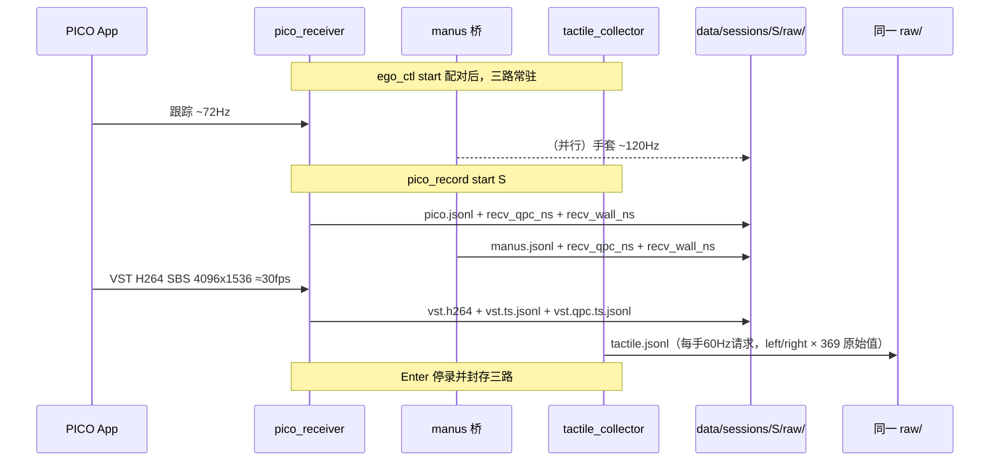
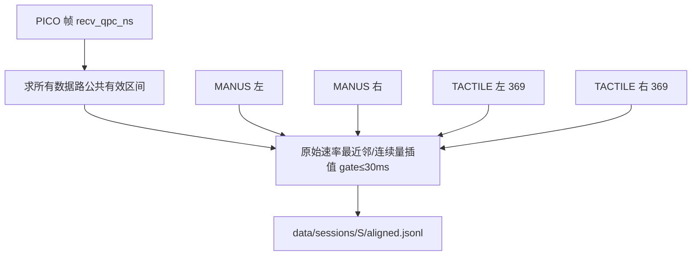
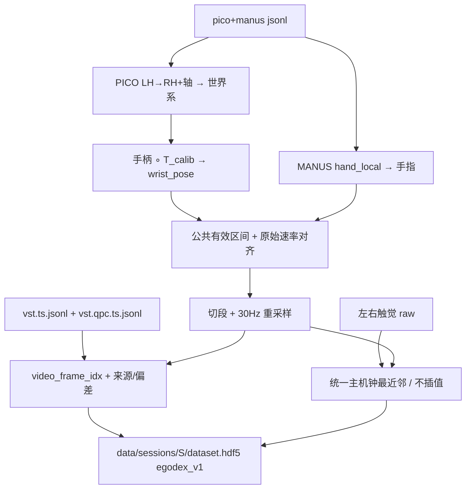
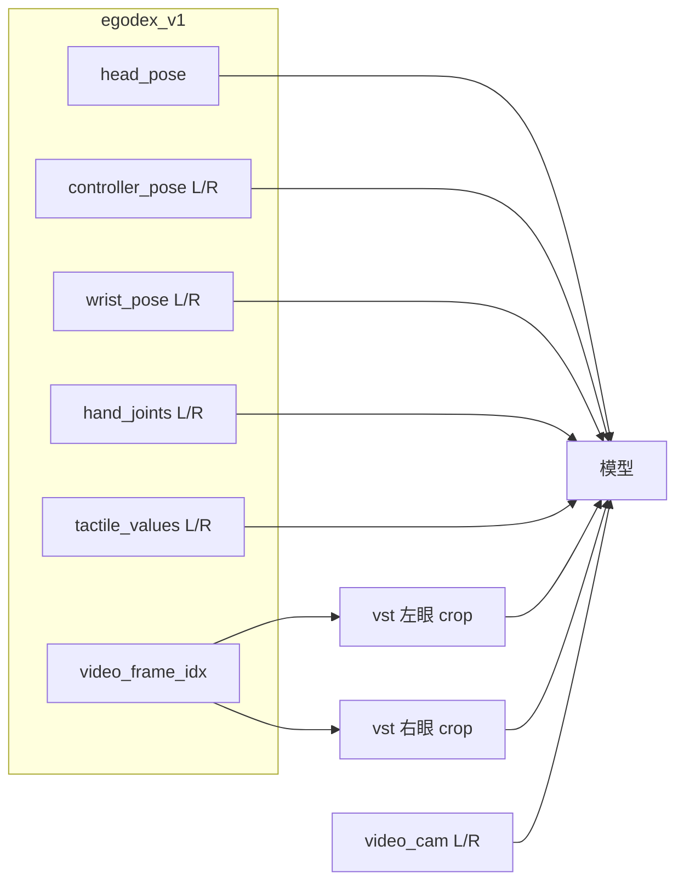

# 数据管线（文档 2/3）：采集 → 对齐 → 处理 → 给模型

操作命令全集见 [`../README.md`](../README.md)。标定验收见 [`CALIB_QA_ZH.md`](CALIB_QA_ZH.md)。  
下文：**每一步的示例图 + 对应命令**（会话名用 `S`）。

---

## 0. 名词

| 旧叫法 | 现名 | 含义 |
|--------|------|------|
| 方案 B / Option B | **训练包 `egodex_v1`** | HDF5：位姿 + 手指 + **双目** VST 帧号 + 双手原始触觉 |
| T_calib.pos | **腕偏移** | 已乘进 `*_wrist_pose` 的 xyz |
| recv_qpc_ns | **首选对齐钟** | 电脑高精度单调钟；Windows 为 QPC |
| recv_wall_ns | **兼容对齐钟** | 旧会话整批回退；也用于审计/可读时间 |
| timeStampNs | **PICO 采样钟** | 仅导出重采样 |

---

## 1. 总览



```bash
cd ~/pico_controller
bash scripts/ego_ctl.sh start && bash scripts/ego_ctl.sh check
python3 pico_record.py start S          # 采集
bash scripts/ego_ctl.sh pipeline S      # 对齐+导出+清单（一条龙）
```

`ego_ctl start` 会在当前终端先采 2 秒静止基线；第二次按 Enter 后等待标准 3 秒倒计时，看到“开始采集”再按住左手触觉区域并持续到成功（活动窗口 4 秒，至少约 0.4 秒显著响应），右手保持不动。识别出的设备绑定左手，另一只按排除法绑定右手。换口或重插后必须 `restart` 重新配对。

---

## 2. 数据采集

### 示例图



### 命令

```bash
bash scripts/ego_ctl.sh start
python3 pico_record.py start S
# Enter 停
ls -lah data/sessions/S/raw/
```

| 文件 | 内容 |
|------|------|
| `pico.jsonl` | 头 + 双手柄（**~72 Hz**） |
| `manus.jsonl` | 双手 25 节点（**~120 Hz**） |
| `vst.h264` | SBS 裸 H.264，**4096×1536**（每眼 2048×1536），**~30 Hz** |
| `vst.ts.jsonl` | 每视频帧 `wall_ns`（**真实帧率唯一来源**） |
| `vst.qpc.ts.jsonl` | 每视频帧高精度主机单调时间戳（新采集对齐用） |
| `data/sessions/S/raw/tactile.jsonl` | 左右手全部 369 通道原始帧（每侧请求 60 Hz） |
| `data/sessions/S/raw/tactile.meta.json` | 左右配对证据、帧数、完整性、字节数与 SHA-256 |

`data/` 各子目录含义与帧率总表见 [`../README.md` §6](../README.md)。开录默认等 PICO、MANUS、VST 和双路触觉连续稳定2秒（`pico_record.py start`）。录制中每0.5秒检查全路，异常持续1.5秒就并发STOP；Windows一键入口会把失败尝试及 `capture.failure.json` 移到 `data/rejected/`，恢复后重采同一编号。`--hands left/right` 不裁触觉；它仍采双侧全部通道。离线 `pipeline` 会校验同名触觉 meta 与 SHA-256，再把触觉加入 aligned/HDF5；原始 JSONL 始终保留。

### VST 分辨率 / 帧率（写清楚）

完整表与命令见 [`../README.md` §3](../README.md)。摘要：

| | 请求默认 | 实际（vc1） |
|--|----------|-------------|
| 整幅 | 4096×1536 SBS | **4096×1536** 左\|右 |
| 单眼 | — | **2048×1536** |
| fps | 请求 30 | **≈30**（sidecar 计；裸流标称值不可作为依据） |
| 格式 | — | 裸 `.h264`，光学=矫正针孔（非鱼眼 RAW） |

```bash
# 查本会话真实 fps
python3 -c "from make_review_video import load_sidecar,sidecar_fps; \
  print(sidecar_fps(load_sidecar('data/sessions/S/raw/vst.ts.jsonl')))"
```

### VST → mp4（预览用；`FR`=上式取整，日常配置约为 30）

```bash
FR=30
ffmpeg -y -framerate $FR -i data/sessions/S/raw/vst.h264 -c copy data/sessions/S/raw/vst.mp4
ffmpeg -y -framerate $FR -i data/sessions/S/raw/vst.h264 \
  -vf "crop=2048:1536:0:0" -c:v libx264 -pix_fmt yuv420p data/sessions/S/raw/vst_left.mp4
ffmpeg -y -framerate $FR -i data/sessions/S/raw/vst.h264 \
  -vf "crop=2048:1536:2048:0" -c:v libx264 -pix_fmt yuv420p data/sessions/S/raw/vst_right.mp4
```

管线继续用 `vst.h264`，不必先转 mp4。训练包默认声明双目；`attrs.video_left_crop` / `video_right_crop` 给出像素矩形。

---

## 3. 数据对齐

### 示例图



### 命令

```bash
python3 align_pico_manus.py \
  data/sessions/S/raw/pico.jsonl data/sessions/S/raw/manus.jsonl \
  --tactile data/sessions/S/raw/tactile.jsonl \
  --tactile-meta data/sessions/S/raw/tactile.meta.json \
  -o data/sessions/S/aligned.jsonl --full

python3 analyze_quality.py data/sessions/S/raw/pico.jsonl data/sessions/S/raw/manus.jsonl
# 看 Δt 中位（目标 <10ms）与覆盖率
```

- 对齐键：新会话优先 **`recv_qpc_ns`**；任一路缺少时整条统一回退
  `recv_wall_ns`，绝不混用时钟域  
- 对齐文件**不**做坐标系转换（留给导出）
- 触觉保留全部 369 个有符号 `int16` 原值；只做最近邻，不做插值/归一化/死点裁剪

---

## 4. 数据处理（导出）

### 示例图



### 命令

```bash
python3 export_dataset.py \
  data/sessions/S/raw/pico.jsonl data/sessions/S/raw/manus.jsonl \
  -o data/sessions/S/dataset.hdf5 \
  --calib config/calib_wrist.json \
  --tactile data/sessions/S/raw/tactile.jsonl \
  --tactile-meta data/sessions/S/raw/tactile.meta.json \
  --vst data/sessions/S/raw/vst.h264 \
  --vst-ts data/sessions/S/raw/vst.ts.jsonl \
  --vst-qpc-ts data/sessions/S/raw/vst.qpc.ts.jsonl \
  --fps 30

python3 data_catalog.py S --write-manifest
```

**必要变换**：① PICO LH→RH+轴 ② T_calib（含腕偏移 pos）③ hand_local。  
**不要**：遥操 Q180、对 MANUS 再 LH→RH、为对齐 NTP 头显。

腕偏移 `pos`：**不单独喂模型**，已在 `*_wrist_pose` 的 xyz 里。  
**禁止**用左眼叠图拧 `pos`（会污染训练 3D；右眼也会不贴）→ 做法见 [`CALIB_QA_ZH.md`](CALIB_QA_ZH.md) §1。

---

## 5. 给模型的数据

### 示例图



| 字段 | 形状 | 含义 |
|------|------|------|
| `timestamp_ns` | (T,) | 重采样时间轴（PICO 采样钟） |
| `source_row_idx` | (T,) | 完整帧筛选前的30 Hz目标行号；可定位被剔除的缺口 |
| `recv_wall_ns` | (T,) | 墙钟（挂视频用） |
| `recv_qpc_ns` | (T,) | 高精度主机单调钟（新会话对齐用） |
| `segment_id` | (T,) | 片段号，勿跨段 |
| `head_pose` | (T,7) | 世界系 |
| `left/right_controller_pose` | (T,7) | 校准前的PICO世界系手柄位置 xyz + 四元数 xyzw |
| `left/right_wrist_pose` | (T,7) | 手柄位姿应用嵌入标定后的世界系腕；供位置/深度修正 |
| `left/right_hand_joints` | (T,25,3) | 腕局部手指 |
| `*_hand_valid` | (T,) | 正式完整帧包中恒为 True；保留供通用读取器兼容 |
| `left/right_hand_source_recv_wall_ns` | (T,) | 最近 MANUS 原始帧墙钟；无效=-1 |
| `left/right_hand_source_recv_qpc_ns` | (T,) | 最近 MANUS 原始帧 QPC；无效=-1 |
| `left/right_hand_offset_ms` | (T,) | MANUS 源帧−目标行；无效=NaN |
| `left/right_tactile_values` | (T,369) int16 | wire 活动通道原值；无效行填 0 |
| `left/right_tactile_valid` | (T,) | 正式完整帧包中恒为 True（30 ms 内命中） |
| `left/right_tactile_recv_wall_ns` | (T,) | 源触觉帧墙钟；无效=-1 |
| `left/right_tactile_recv_qpc_ns` | (T,) | 源触觉帧 QPC；无效=-1 |
| `left/right_tactile_stream_seq` | (T,) | 源设备流序号；无效=-1 |
| `left/right_tactile_record_seq` | (T,) | 源 JSONL 全局序号；无效=-1 |
| `left/right_tactile_offset_ms` | (T,) | 源墙钟−目标墙钟；无效=NaN |
| `left/right_tactile_fingers` | (T,5,4,8) | 五片实物指端阵列；顺序 thumb/index/middle/ring/pinky；无效点置 0 |
| `left/right_tactile_fingers_active_mask` | (5,4,8) | 物理有效点；拇指32点，其余四指各28点，总计144 |
| `tactile_finger_manus_node_ids` | (5,5) | 五指对应 MANUS 源节点组；thumb 末位=-1 |
| `video_frame_idx` | (T,) | SBS 整帧号；-1=未匹配 |
| `video_frame_idx_left/_right` | (T,) | 与上相同（左右共享一帧） |
| `video_valid` | (T,) | 正式完整帧包中恒为 True（30 ms 内命中） |
| `video_source_recv_wall_ns/qpc_ns` | (T,) | 视频源帧的双时间戳 |
| `video_offset_ms` | (T,) | 视频源帧−目标行；无效=NaN |

关键 attrs：`schema_revision=egodex_v1+sync_v2+tactile_v3+complete_frames_v4`、`alignment_clock`、
`common_interval_start_ns/end_ns`、`alignment_quality`、`tactile_included=True`、
`tactile_value_count=369`、`tactile_physical_active_count=144`、
`tactile_palm_present=False`。MANUS、VST 视频和触觉最近邻门限均为 30 ms；
默认严格门禁为各路覆盖率 ≥99%、完整帧覆盖率 ≥99%、p95 ≤20 ms、最大偏差 ≤30 ms，
不通过就不生成 HDF5。通过后剔除不完整目标行并在每个缺口重新切段，
`all_exported_frames_complete=True`；`controller_to_wrist_calibration` 内嵌实际标定数值。
p95 表示 95% 的有效匹配帧时间偏差不超过该值，不是覆盖率。当前实物无手掌阵列；手指仅做组级对应，
单格不对应 MANUS 关节。视频仍使用 `video_stereo=True`、左右 crop 与 `video_cam`。

```python
import json, h5py, cv2

with h5py.File("data/sessions/S/dataset.hdf5", "r") as f:
    head = f["head_pose"][:]
    fi = f["video_frame_idx"][:]
    vpath = f.attrs["video_path"]
    cl = json.loads(f.attrs["video_left_crop"])
    cr = json.loads(f.attrs["video_right_crop"])
    cam = json.loads(f.attrs["video_cam"])  # left/right R,t + intrinsics_native

# 读 SBS 第 fi[i] 帧后:
# left  = frame[:, cl["x"]:cl["x"]+cl["w"]]
# right = frame[:, cr["x"]:cr["x"]+cr["w"]]
```

> PC 侧 VST 是矫正针孔 SBS，与头显原生鱼眼 RAW SBS 光学不同；接 NVIDIA 双目深度时用**本包左右 crop + `video_cam`**，勿直接套鱼眼 `camera_params.json`。

---

## 6. 时钟

| 用途 | 钟 |
|------|-----|
| PICO↔MANUS↔视频↔触觉 | 新会话 `recv_qpc_ns`；旧会话整批 `recv_wall_ns` |
| 导出重采样 | `timeStampNs` |
| NTP 头显 | 不需要 |

---

## 7. 自检

```bash
bash scripts/ego_ctl.sh check
python3 data_catalog.py
python3 data_catalog.py S --write-manifest
python3 data_catalog.py --schema    # 对接用完整 schema
```
