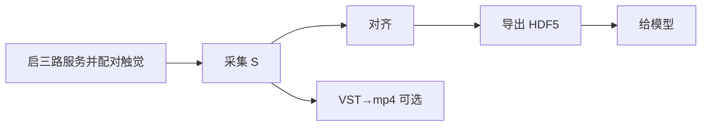

# pico_controller — 操作手册（文档 1/3）

PICO 头显/手柄 + MANUS 手套 + 双手触觉指套，**无 ROS**。四路数据统一进入对齐与 `egodex_v1`，并保存原始值和来源时间戳。

| 文档 | 内容 |
|------|------|
| **本文件** | **全部常用命令**（采集 / 对齐 / 处理 / VST→mp4） |
| [`docs/PIPELINE_ZH.md`](docs/PIPELINE_ZH.md) | 数据含义 + **示例图** + 给模型字段 |
| [`docs/CALIB_QA_ZH.md`](docs/CALIB_QA_ZH.md) | 标定与视频验收 |

机器：`~/pico_controller`，命令用系统 `python3`。下面把会话名写成 `S`，换成你的任务名即可。

---

## 0. 总流程（一眼）



---

## 1. 启停服务

```bash
cd ~/pico_controller
bash scripts/ego_ctl.sh start
bash scripts/ego_ctl.sh check
# 停: bash scripts/ego_ctl.sh stop
```

`start` 必须在交互终端运行：先松开两只触觉指套采 2 秒基线；第二次按 Enter 后等待标准 3 秒倒计时，看到“开始采集”再按住左手任意触觉区域并持续到成功（活动窗口 4 秒，至少约 0.4 秒显著响应），右手保持不动。识别出的设备绑定左手，另一只自动绑定右手。该绑定只在本次服务进程有效，触觉 USB 换口或重插后必须运行 `bash scripts/ego_ctl.sh restart` 重新配对。

MANUS 固定 `hand-motion=none`。头显连本机，App 开 Send + Head + Controller。

---

## 2. 数据采集

```bash
python3 pico_record.py start S
# 默认等待 PICO、MANUS、VST 和左右触觉原始流全部就绪
# 做动作…
# 本终端 Enter 或 Ctrl+C 停录（不要 Ctrl+C 服务窗口）
```

产出：

```text
data/sessions/S/
  raw/
    pico.jsonl
    manus.jsonl
    manus.meta.json
    tactile.jsonl     # 左右手全部 369 通道原始帧
    tactile.meta.json # 配对及完整性元数据
    vst.h264          # 左右眼并排 4096x1536
    vst.ts.jsonl      # 每帧对齐钟
  aligned.jsonl
  dataset.hdf5
  manifest.json
  review/
```

只录一只运动手：`python3 pico_record.py start S --hands left`（触觉仍完整采左右两侧）。旧双路兼容模式显式加 `--no-tactile`。

`pipeline` 会处理同一任务 `raw/` 中的 PICO、MANUS、VST 和触觉数据。

一键复验（对齐+导出+清单）：

```bash
bash scripts/ego_ctl.sh pipeline S
```

---

## 3. VST h264 → mp4（给人看）

录制默认是裸 H.264。转 mp4（默认请求 **60fps**，与 `--video-fps` 一致）：

```bash
# 整幅 SBS（左右眼并排，可直接播放）
ffmpeg -y -framerate 60 -i data/sessions/S/raw/vst.h264 -c copy data/sessions/S/raw/vst.mp4

# 若播放器不认 copy，再编码一版：
ffmpeg -y -framerate 60 -i data/sessions/S/raw/vst.h264 \
  -c:v libx264 -pix_fmt yuv420p data/sessions/S/raw/vst.mp4

# 只要左眼 2048x1536（训练/验收常用）
ffmpeg -y -framerate 60 -i data/sessions/S/raw/vst.h264 \
  -vf "crop=2048:1536:0:0" -c:v libx264 -pix_fmt yuv420p \
  data/sessions/S/raw/vst_left.mp4
```

> 对齐/导出/叠骨架仍可用 **`vst.h264` + `vst.ts.jsonl`**，不必先转 mp4。  
> mp4 只为方便人眼预览；`framerate` 若和实际不符，画面速度会偏，以 sidecar 帧数为准。

---

## 4. 数据对齐

```bash
python3 align_pico_manus.py \
  data/sessions/S/raw/pico.jsonl data/sessions/S/raw/manus.jsonl \
  -o data/sessions/S/aligned.jsonl --full

# 质检 Δt / 覆盖率
python3 analyze_quality.py data/sessions/S/raw/pico.jsonl data/sessions/S/raw/manus.jsonl
```

对齐键：新采集优先 `recv_qpc_ns`；旧采集整条统一回退 `recv_wall_ns`。产出：`data/sessions/S/aligned.jsonl`。

---

## 5. 数据处理（导出训练包）

```bash
python3 export_dataset.py \
  data/sessions/S/raw/pico.jsonl data/sessions/S/raw/manus.jsonl \
  -o data/sessions/S/dataset.hdf5 \
  --calib config/calib_wrist.json \
  --vst data/sessions/S/raw/vst.h264 \
  --vst-ts data/sessions/S/raw/vst.ts.jsonl \
  --fps 30

python3 data_catalog.py S --write-manifest
```

写出 **`egodex_v1`**：位姿 + 手指 + `video_frame_idx`；先裁公共有效区间，按统一主机钟对齐并执行严格覆盖率/偏差门禁。  
字段与示例图见 `docs/PIPELINE_ZH.md`。

叠视频验收（需已标定，见 `CALIB_QA_ZH.md`）：

```bash
python3 overlay_skeleton.py data/sessions/S/aligned.jsonl data/sessions/S/raw/vst.h264 \
  -o data/sessions/S/review/overlay.mp4 --out-fps 15
```

---

## 6. 目录

```text
data/sessions/<S>/  单条任务根目录
  raw/              全部传感器原始数据
  aligned.jsonl     时间对齐 JSONL
  dataset.hdf5      训练 HDF5 egodex_v1
  review/           叠加验收 mp4
data/raw|tactile_raw|aligned|export|review/  旧数据兼容读取
config/             calib_wrist / pico_cam / *.mcal
.run/               服务日志
```

对接：`python3 data_catalog.py --schema`
